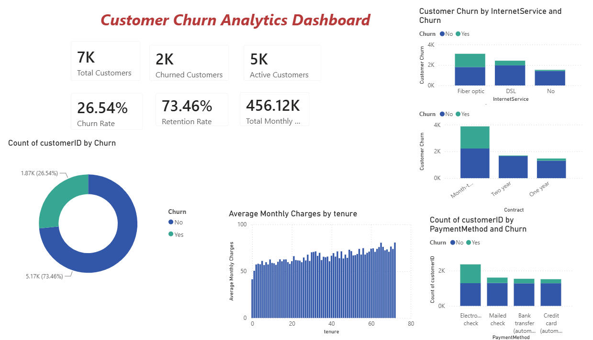
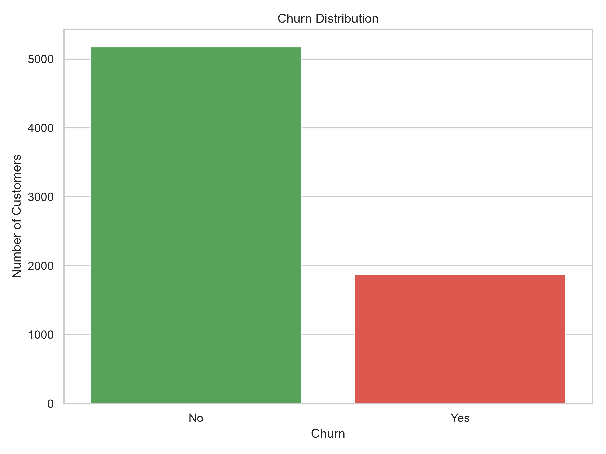
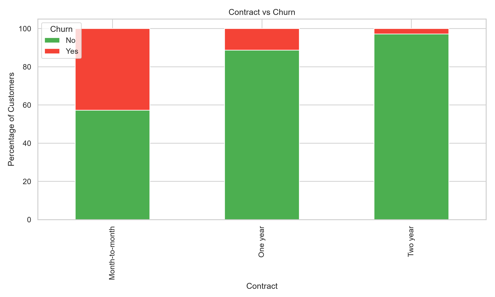
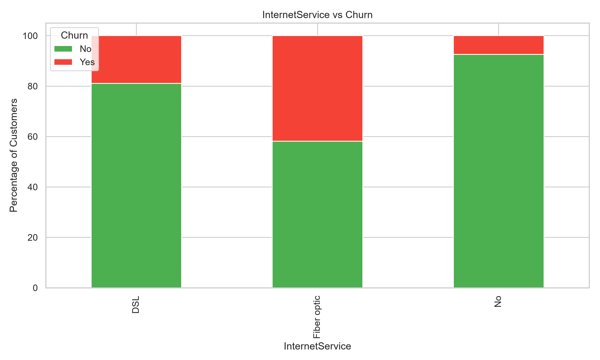
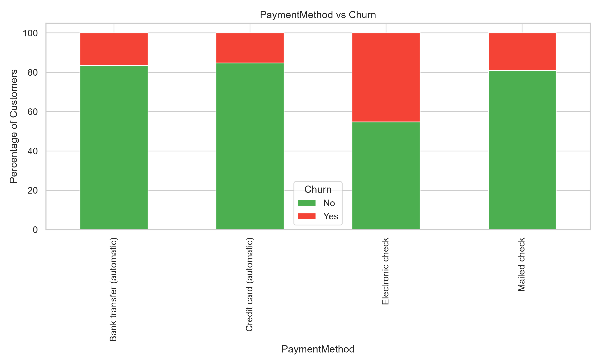
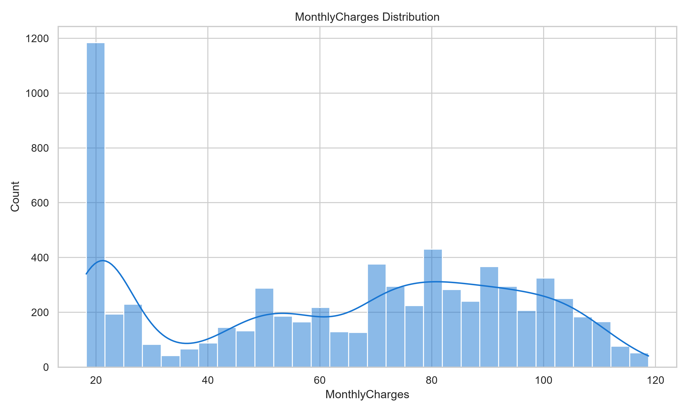
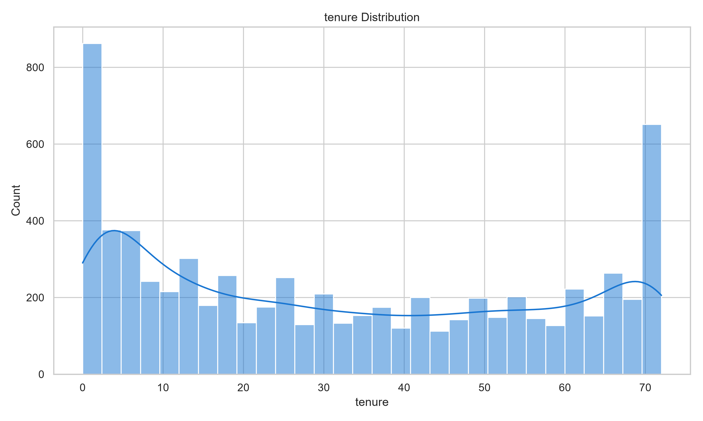
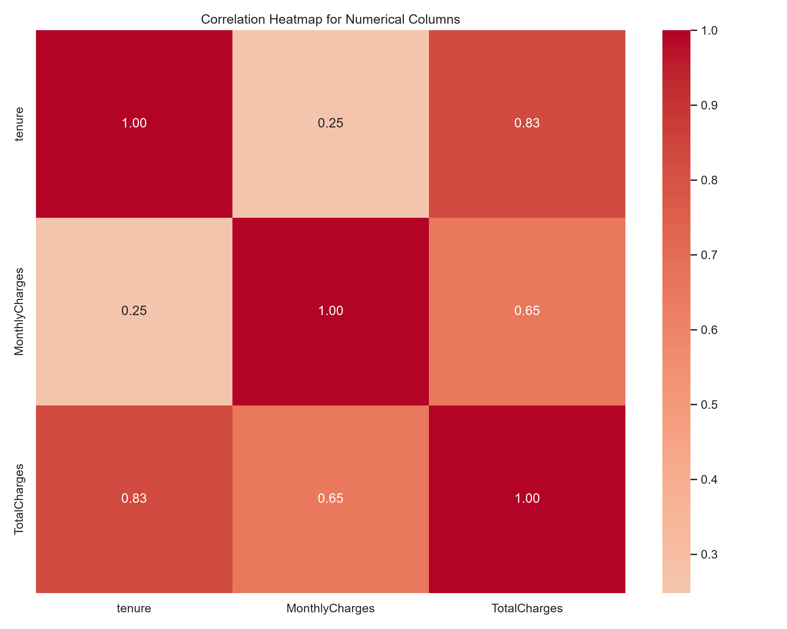
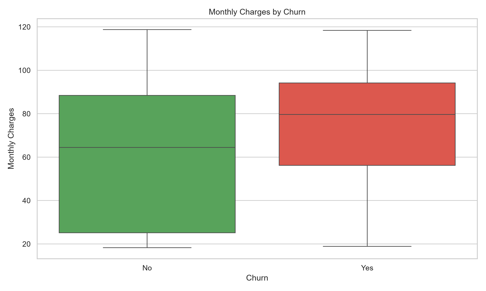

# 📊 Customer Churn Analytics & Business Intelligence Dashboard

An end-to-end **Data Analytics** project built using **Python, SQL, and Power BI** to analyze customer churn, uncover business insights, and build an executive dashboard for decision-making.

---

# 📌 Dashboard Preview

---

# 📈 Exploratory Data Analysis

| Churn Distribution | Contract vs Churn |
|:------------------:|:-----------------:|
|  |  |

| Internet Service | Payment Method |
|:----------------:|:--------------:|
|  |  |

| Monthly Charges | Tenure Distribution |
|:---------------:|:-------------------:|
|  |  |

| Correlation Heatmap | Monthly Charges by Churn |
|:-------------------:|:------------------------:|
|  |  |

---

# 🚀 Project Highlights

- ✅ Cleaned and transformed **7,043 customer records**
- ✅ Performed **Exploratory Data Analysis (EDA)** using Pandas & Matplotlib
- ✅ Wrote **25+ SQL business queries** for KPI reporting
- ✅ Built an **interactive Power BI dashboard**
- ✅ Identified key churn drivers and revenue loss patterns
- ✅ Generated actionable business recommendations for customer retention

---

# 🛠 Tech Stack

- Python
- SQL (MySQL)
- Power BI
- Pandas
- NumPy
- Matplotlib
- Git & GitHub

---
