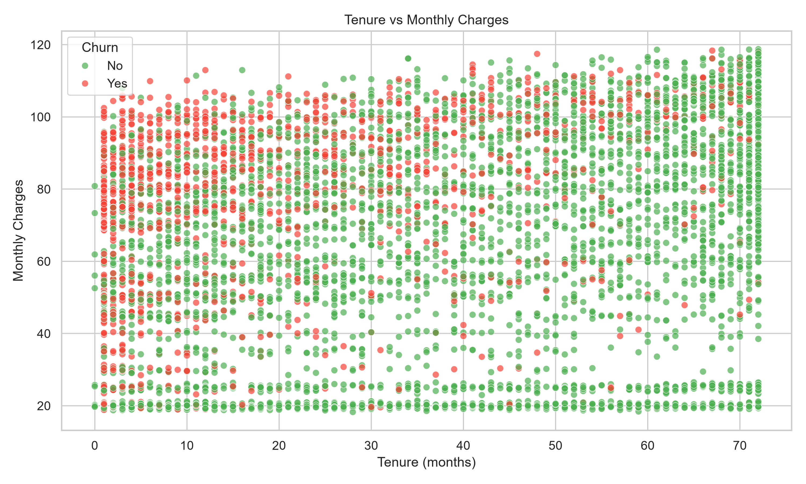
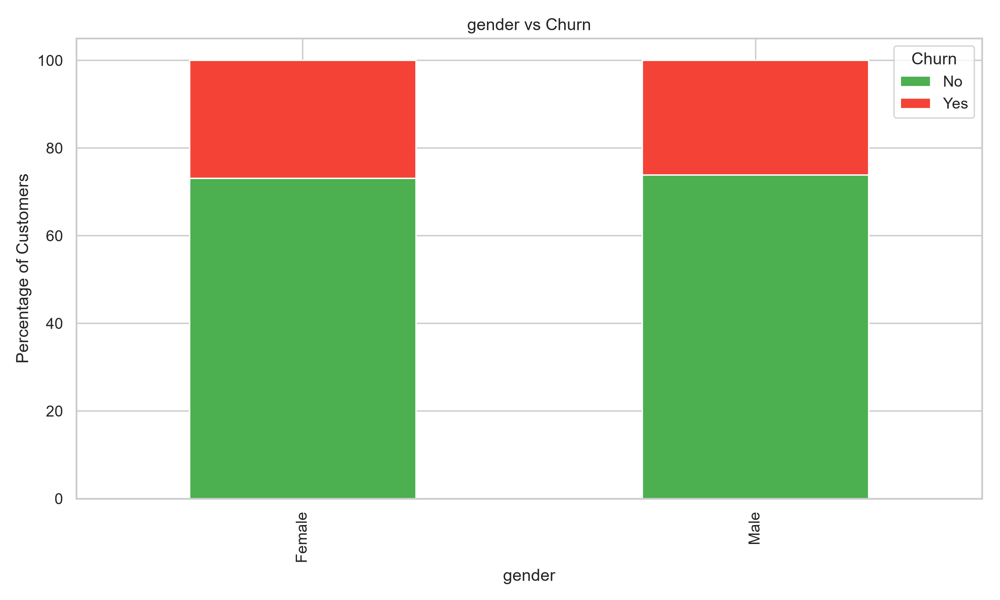
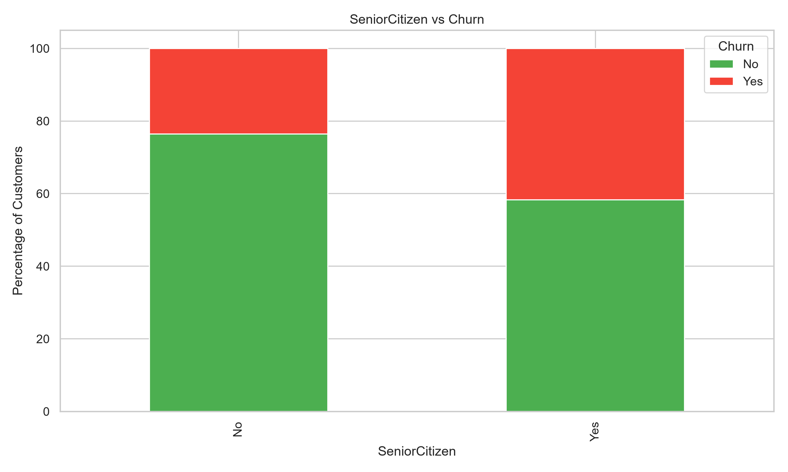

# 📊 Customer Churn Analytics & Business Intelligence Dashboard

An end-to-end **Data Analytics** project built using **Python, SQL, and Power BI** to analyze customer churn, identify key business drivers, and create an executive dashboard for data-driven decision making.

<p align="center">


</p>

---

# 📌 Dashboard Preview

<p align="center">

</p>

---

# 📈 Exploratory Data Analysis

| Churn Distribution | Contract vs Churn |
|:------------------:|:-----------------:|
|  |  |

| Internet Service | Payment Method |
|:----------------:|:--------------:|
|  |  |

| Monthly Charges Distribution | Monthly Charges by Churn |
|:----------------------------:|:------------------------:|
|  |  |

| Tenure Distribution | Tenure vs Monthly Charges |
|:-------------------:|:-------------------------:|
|  |  |

| Gender vs Churn | Senior Citizen vs Churn |
|:---------------:|:-----------------------:|
|  |  |

| Correlation Heatmap |
|:-------------------:|
|  |

---

# 🚀 Project Highlights

- Built a complete customer churn analytics pipeline using **Python, SQL, and Power BI**
- Cleaned and transformed **7,043 customer records**
- Performed comprehensive **Exploratory Data Analysis (EDA)**
- Developed **25+ SQL business queries** for KPI reporting
- Created an interactive **Power BI Executive Dashboard**
- Identified major churn drivers and revenue loss patterns
- Generated actionable business recommendations for customer retention

---

# 🎯 Business Problem

Customer churn directly impacts recurring revenue and customer acquisition costs. This project aims to understand why customers leave, quantify revenue loss, identify high-risk customer segments, and provide actionable insights to improve customer retention.

---

# 🎯 Objectives

- Clean and preprocess the IBM Telco Customer Churn dataset
- Perform exploratory data analysis to discover churn patterns
- Calculate business KPIs and revenue metrics
- Build SQL reports for business analysis
- Design an interactive Power BI dashboard
- Generate actionable recommendations to reduce churn

---

# 📂 Dataset

Dataset Used:

**IBM Telco Customer Churn Dataset**

The dataset contains customer-level information including:

- Customer Demographics
- Contract Information
- Internet Services
- Payment Methods
- Monthly Charges
- Total Charges
- Customer Tenure
- Churn Status

Raw Dataset:

```
data/WA_Fn-UseC_-Telco-Customer-Churn.csv
```

Processed Dataset:

```
data/cleaned_churn.csv
```

---

# 🛠 Technology Stack

- Python 3.12
- SQL (MySQL Compatible)
- Power BI
- Pandas
- NumPy
- Matplotlib
- Git
- GitHub

---

# 🧹 Data Cleaning

Data preprocessing includes:

- Handling missing values
- Converting TotalCharges to numeric
- Cleaning categorical variables
- Removing duplicate records
- Standardizing column formats
- Feature transformation
- Exporting cleaned dataset

---

# 📊 Exploratory Data Analysis

The project performs:

- Customer churn distribution analysis
- Contract type analysis
- Payment method analysis
- Internet service analysis
- Monthly charges distribution
- Tenure distribution
- Correlation heatmap
- Scatter plot analysis
- Customer segmentation

All visualizations are automatically saved inside the **images/** directory.

---

# 🗄 SQL Analysis

The project includes **25+ SQL queries** covering:

- Total Customers
- Churn Rate
- Retention Rate
- Revenue Analysis
- Contract-wise Churn
- Internet Service Analysis
- Payment Method Analysis
- Monthly Revenue
- Revenue Lost due to Churn
- Customer Segmentation
- Top Paying Customers
- Business KPI Reporting

---

# 📈 Key Performance Indicators (KPIs)

- Total Customers
- Active Customers
- Churned Customers
- Churn Rate
- Retention Rate
- Average Monthly Charges
- Average Customer Tenure
- Monthly Revenue
- Revenue Lost due to Churn

---

# 💡 Business Insights

- Month-to-month contracts exhibit the highest churn rates.
- Customers paying higher monthly charges are more likely to churn.
- Fiber Optic customers demonstrate relatively higher churn.
- Early-tenure customers require stronger onboarding strategies.
- Contract type and payment method strongly influence customer retention.

---

# ✅ Recommendations

- Launch targeted retention campaigns for month-to-month customers.
- Improve onboarding experience for new customers.
- Offer loyalty discounts for long-term subscribers.
- Optimize pricing strategies for high monthly charge customers.
- Improve service quality for high-risk customer segments.
- Encourage customers to migrate toward long-term contracts.

---

# 📊 Power BI Dashboard

The interactive dashboard includes:

- Customer KPIs
- Churn Rate
- Retention Rate
- Revenue Analysis
- Customer Segmentation
- Contract Analysis
- Payment Method Analysis
- Interactive Filters and Slicers

---

# 📁 Project Structure

```
Customer-Churn-Analytics
│
├── data/
│   ├── WA_Fn-UseC_-Telco-Customer-Churn.csv
│   └── cleaned_churn.csv
│
├── src/
│   ├── data_preprocessing.py
│   └── eda.py
│
├── sql/
│   └── analysis.sql
│
├── dashboard/
│   └── dax_measures.md
│
├── images/
│   ├── dashboard.png
│   ├── churn_distribution.png
│   ├── contract_vs_churn.png
│   ├── paymentmethod_vs_churn.png
│   ├── internetservice_vs_churn.png
│   ├── gender_vs_churn.png
│   ├── seniorcitizen_vs_churn.png
│   ├── tenure_distribution.png
│   ├── monthlycharges_distribution.png
│   ├── monthly_charges_by_churn_boxplot.png
│   ├── tenure_vs_monthly_charges_scatter.png
│   └── correlation_heatmap.png
│
├── requirements.txt
└── README.md
```

---

# 🚀 Future Improvements

- Predict customer churn using Machine Learning models.
- Deploy the dashboard online.
- Build a real-time data pipeline.
- Integrate customer support and marketing datasets.
- Automate report generation using scheduled workflows.

---

# ▶️ How to Run

### Clone the Repository

```bash
git clone https://github.com/sanyuktaraut09/Customer-Churn-Analytics.git
cd Customer-Churn-Analytics
```

### Create Virtual Environment

```bash
python -m venv .venv
```

### Activate Environment

Windows

```bash
.venv\Scripts\activate
```

### Install Dependencies

```bash
pip install -r requirements.txt
```

### Run Data Preprocessing

```bash
python src/data_preprocessing.py
```

### Run Exploratory Data Analysis

```bash
python src/eda.py
```

### Execute SQL Queries

Run the queries inside:

```
sql/analysis.sql
```

using MySQL or any compatible SQL database.

---

# 👩‍💻 Author

**Sanyukta Raut**

- LinkedIn: https://www.linkedin.com/in/sanyukta-raut-7553262a0/
- GitHub: https://github.com/sanyuktaraut09

---
